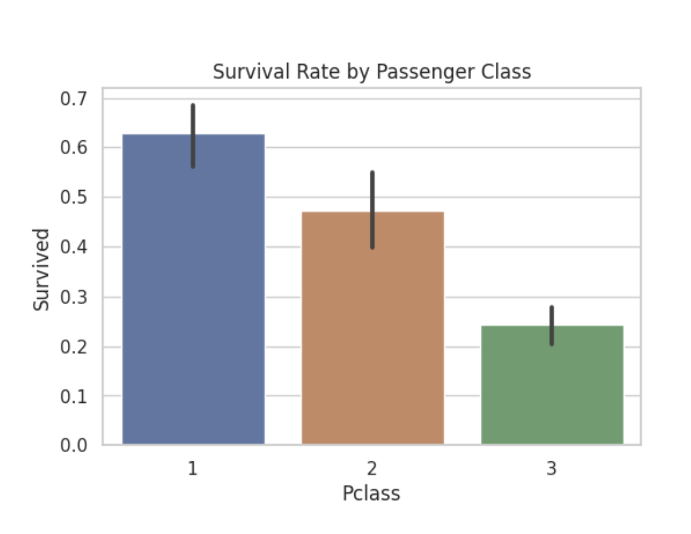
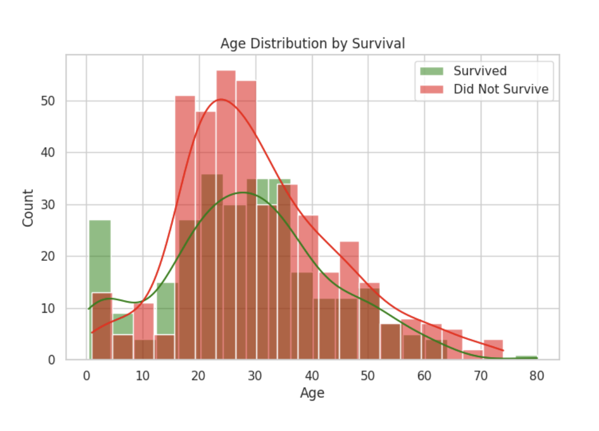

# Titanic Survival Prediction 

## Overview
This project predicts the survival of passengers on the Titanic using the famous Kaggle competition dataset:  
[Titanic - Machine Learning from Disaster](https://www.kaggle.com/competitions/titanic)

It includes:
- **Exploratory Data Analysis (EDA)** with visualizations.
- **Data preprocessing** (handling missing values, encoding categorical features).
- **Model training** using Random Forest Classifier.
- **Submission file** for Kaggle competition.

## Dataset
The dataset contains information about Titanic passengers, such as:
- Passenger class
- Gender
- Age
- Number of siblings/spouses aboard
- Number of parents/children aboard
- Fare
- Port of embarkation

**Target variable**: `Survived` (1 = Yes, 0 = No)

Dataset is available on Kaggle:  
[Click here to access](https://www.kaggle.com/competitions/titanic/data)

## EDA Highlights
- **Gender**: Women had a much higher survival rate.
- **Passenger Class**: Higher classes (1st) had higher survival rates.
- **Age**: Children had better chances of survival than adults.

## Model
- **Algorithm**: Random Forest Classifier
- **Parameters**: 300 estimators, max depth = 6
- **Validation Accuracy**: ~79.9%
- **Kaggle Public Leaderboard Score**: **0.77990**

## Files in this Repository
- `titanic-survival-prediction.ipynb` → Jupyter Notebook with EDA, preprocessing, model, and submission generation.
- `submission.csv` → Prediction file submitted to Kaggle.
- `README.md` → Project documentation.

## How to Run
1. Clone this repository:
   ```bash
   git clone https://github.com/<your-username>/titanic-survival-prediction.git
   cd titanic-survival-prediction

pip install pandas numpy scikit-learn matplotlib seaborn
jupyter notebook titanic-survival-prediction.ipynb


## Visualizations

**Survival Rate by Gender**



**Age Distribution by Survival**



